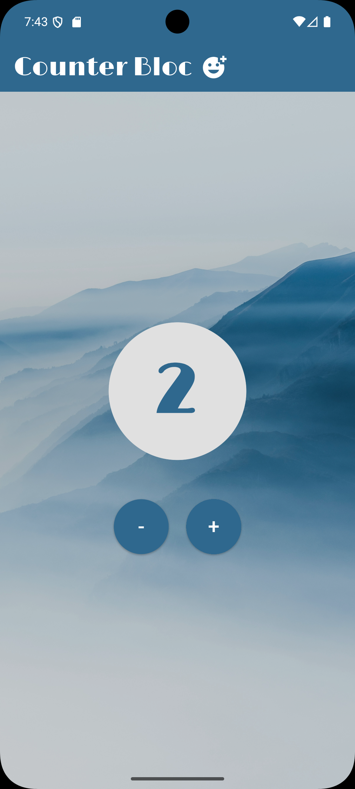

# Bloc Counter App
Simple Flutter counter using BLoC pattern for state management. Demonstrates events, reactive UI, and clean separation of business logic from presentation.



## Features
- Increment/decrement counter with + and - buttons

- Big circle counter display 

- BlocObserver logs state changes to console

- Modern on<Event> syntax (not deprecated mapEventToState)

## Project Structure
```
lib/
├── bloc/
│   ├── counter_bloc.dart    # Counter logic (extends Bloc)
│   └── counter_event.dart   # Events enum (increment, decrement)
├── widgets/
│   └── home.dart           # UI with BlocBuilder
└── main.dart               # BlocProvider + BlocObserver
```

## Setup
```
flutter create bloc_counter
```

Add to pubspec.yaml:

```
dependencies:
  flutter_bloc: ^9.1.1 (or latest)
```
```
flutter pub get

flutter run
```
## How It Works

Event Flow: User taps button → dispatches CounterEvent → CounterBloc processes event → emits new int state → BlocBuilder rebuilds UI with updated counter value.

## Key Components:

- BlocProvider creates and provides CounterBloc instance to widget tree

- CounterBloc handles events using on<CounterEvent> and emits state via emit()

- BlocBuilder listens to state stream and rebuilds child widget when state changes

## How It Works 
- Events: Like buttons telling "what to do" (increment, decrement)

- Bloc: Brain that gets events and updates counter number

- BlocBuilder: Eyes that watch number changes and redraw screen

- BlocProvider: Gives Bloc brain to whole app

- When you tap +, it sends increment event → Bloc adds 1 → Builder shows new number.

## Key Files Explained
counter_event.dart

```dart
enum CounterEvent { increment, decrement }
```

counter_bloc.dart (business logic)

```dart
class CounterBloc extends Bloc<CounterEvent, int> {
  CounterBloc() : super(0) {
    on<CounterEvent>((event, emit) {
      // Handles +1 or -1
    });
  }
}
```

main.dart (setup Bloc)

```dart
BlocProvider<CounterBloc>(
  create: (context) => CounterBloc(),
  child: Home(),
)
```

home.dart (UI reacts)

```dart
BlocBuilder<CounterBloc, int>(
  builder: (context, state) => Text('$state'), // Rebuilds on change
)
```

## Testing
Run app → tap buttons → check console:

```
CounterBloc 0 -> 1
CounterBloc 1 -> 2
```

## Learning Points
- BLoC separates "what happens" (logic) from "what user sees" (UI)

- Reactive: UI auto-updates when state changes (no manual setState!)

- Scalable: Add more events/states easily

- Modern syntax: on<Event> instead of old mapEventToState

## Author
[Mayuree Reunsati](https://github.com/mareerray)

March 2026